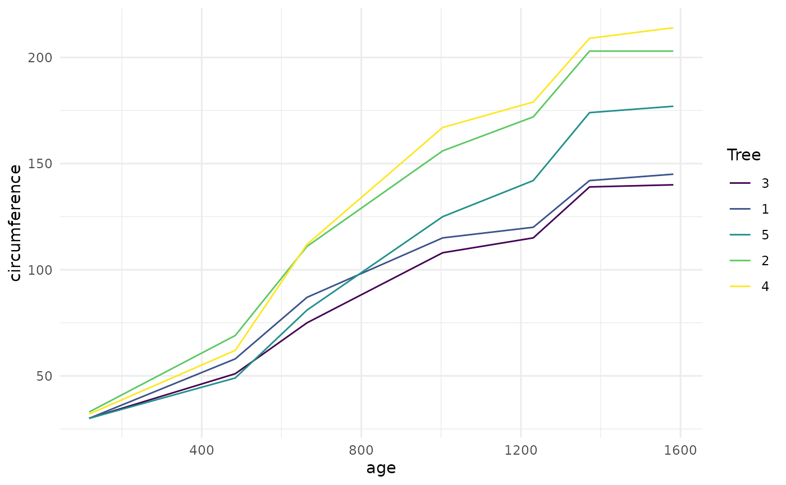

# broom and dplyr

## broom and dplyr

While broom is useful for summarizing the result of a single analysis in
a consistent format, it is really designed for high-throughput
applications, where you must combine results from multiple analyses.
These could be subgroups of data, analyses using different models,
bootstrap replicates, permutations, and so on. In particular, it plays
well with the `nest/unnest` functions in `tidyr` and the `map` function
in `purrr`. First, loading necessary packages and setting some defaults:

``` r
library(broom)
library(tibble)
library(ggplot2)
library(dplyr)
library(tidyr)
library(purrr)

theme_set(theme_minimal())
```

Let’s try this on a simple dataset, the built-in `Orange`. We start by
coercing `Orange` to a `tibble`. This gives a nicer print method that
will especially useful later on when we start working with list-columns.

``` r
data(Orange)

Orange <- as_tibble(Orange)
Orange
```

    ## # A tibble: 35 × 3
    ##    Tree    age circumference
    ##    <ord> <dbl>         <dbl>
    ##  1 1       118            30
    ##  2 1       484            58
    ##  3 1       664            87
    ##  4 1      1004           115
    ##  5 1      1231           120
    ##  6 1      1372           142
    ##  7 1      1582           145
    ##  8 2       118            33
    ##  9 2       484            69
    ## 10 2       664           111
    ## # ℹ 25 more rows

This contains 35 observations of three variables: `Tree`, `age`, and
`circumference`. `Tree` is a factor with five levels describing five
trees. As might be expected, age and circumference are correlated:

``` r
cor(Orange$age, Orange$circumference)
```

    ## [1] 0.9135189

``` r
ggplot(Orange, aes(age, circumference, color = Tree)) +
  geom_line()
```



Suppose you want to test for correlations individually *within* each
tree. You can do this with dplyr’s `group_by`:

``` r
Orange |>
  group_by(Tree) |>
  summarize(correlation = cor(age, circumference))
```

    ## # A tibble: 5 × 2
    ##   Tree  correlation
    ##   <ord>       <dbl>
    ## 1 3           0.988
    ## 2 1           0.985
    ## 3 5           0.988
    ## 4 2           0.987
    ## 5 4           0.984

(Note that the correlations are much higher than the aggregated one, and
furthermore we can now see it is similar across trees).

Suppose that instead of simply estimating a correlation, we want to
perform a hypothesis test with `cor.test`:

``` r
ct <- cor.test(Orange$age, Orange$circumference)
ct
```

    ## 
    ##  Pearson's product-moment correlation
    ## 
    ## data:  Orange$age and Orange$circumference
    ## t = 12.9, df = 33, p-value = 1.931e-14
    ## alternative hypothesis: true correlation is not equal to 0
    ## 95 percent confidence interval:
    ##  0.8342364 0.9557955
    ## sample estimates:
    ##       cor 
    ## 0.9135189

This contains multiple values we could want in our output. Some are
vectors of length 1, such as the p-value and the estimate, and some are
longer, such as the confidence interval. We can get this into a nicely
organized tibble using the `tidy` function:

``` r
tidy(ct)
```

    ## # A tibble: 1 × 8
    ##   estimate statistic  p.value parameter conf.low conf.high method      
    ##      <dbl>     <dbl>    <dbl>     <int>    <dbl>     <dbl> <chr>       
    ## 1    0.914      12.9 1.93e-14        33    0.834     0.956 Pearson's p…
    ## # ℹ 1 more variable: alternative <chr>

Often, we want to perform multiple tests or fit multiple models, each on
a different part of the data. In this case, we recommend a
`nest-map-unnest` workflow. For example, suppose we want to perform
correlation tests for each different tree. We start by `nest`ing our
data based on the group of interest:

``` r
nested <- Orange |>
  nest(data = -Tree)
```

Then we run a correlation test for each nested tibble using
[`purrr::map`](https://purrr.tidyverse.org/reference/map.html):

``` r
nested |>
  mutate(test = map(data, ~ cor.test(.x$age, .x$circumference)))
```

    ## # A tibble: 5 × 3
    ##   Tree  data             test   
    ##   <ord> <list>           <list> 
    ## 1 1     <tibble [7 × 2]> <htest>
    ## 2 2     <tibble [7 × 2]> <htest>
    ## 3 3     <tibble [7 × 2]> <htest>
    ## 4 4     <tibble [7 × 2]> <htest>
    ## 5 5     <tibble [7 × 2]> <htest>

This results in a list-column of S3 objects. We want to tidy each of the
objects, which we can also do with `map`.

``` r
nested |>
  mutate(
    test = map(data, ~ cor.test(.x$age, .x$circumference)), # S3 list-col
    tidied = map(test, tidy)
  )
```

    ## # A tibble: 5 × 4
    ##   Tree  data             test    tidied          
    ##   <ord> <list>           <list>  <list>          
    ## 1 1     <tibble [7 × 2]> <htest> <tibble [1 × 8]>
    ## 2 2     <tibble [7 × 2]> <htest> <tibble [1 × 8]>
    ## 3 3     <tibble [7 × 2]> <htest> <tibble [1 × 8]>
    ## 4 4     <tibble [7 × 2]> <htest> <tibble [1 × 8]>
    ## 5 5     <tibble [7 × 2]> <htest> <tibble [1 × 8]>

Finally, we want to unnest the tidied data frames so we can see the
results in a flat tibble. All together, this looks like:

``` r
Orange |>
  nest(data = -Tree) |>
  mutate(
    test = map(data, ~ cor.test(.x$age, .x$circumference)), # S3 list-col
    tidied = map(test, tidy)
  ) |>
  unnest(tidied)
```

    ## # A tibble: 5 × 11
    ##   Tree  data     test    estimate statistic  p.value parameter conf.low
    ##   <ord> <list>   <list>     <dbl>     <dbl>    <dbl>     <int>    <dbl>
    ## 1 1     <tibble> <htest>    0.985      13.0  4.85e-5         5    0.901
    ## 2 2     <tibble> <htest>    0.987      13.9  3.43e-5         5    0.914
    ## 3 3     <tibble> <htest>    0.988      14.4  2.90e-5         5    0.919
    ## 4 4     <tibble> <htest>    0.984      12.5  5.73e-5         5    0.895
    ## 5 5     <tibble> <htest>    0.988      14.1  3.18e-5         5    0.916
    ## # ℹ 3 more variables: conf.high <dbl>, method <chr>, alternative <chr>

This workflow becomes even more useful when applied to regressions.
Untidy output for a regression looks like:

``` r
lm_fit <- lm(age ~ circumference, data = Orange)
summary(lm_fit)
```

    ## 
    ## Call:
    ## lm(formula = age ~ circumference, data = Orange)
    ## 
    ## Residuals:
    ##     Min      1Q  Median      3Q     Max 
    ## -317.88 -140.90  -17.20   96.54  471.16 
    ## 
    ## Coefficients:
    ##               Estimate Std. Error t value Pr(>|t|)    
    ## (Intercept)    16.6036    78.1406   0.212    0.833    
    ## circumference   7.8160     0.6059  12.900 1.93e-14 ***
    ## ---
    ## Signif. codes:  0 '***' 0.001 '**' 0.01 '*' 0.05 '.' 0.1 ' ' 1
    ## 
    ## Residual standard error: 203.1 on 33 degrees of freedom
    ## Multiple R-squared:  0.8345, Adjusted R-squared:  0.8295 
    ## F-statistic: 166.4 on 1 and 33 DF,  p-value: 1.931e-14

where we tidy these results, we get multiple rows of output for each
model:

``` r
tidy(lm_fit)
```

    ## # A tibble: 2 × 5
    ##   term          estimate std.error statistic  p.value
    ##   <chr>            <dbl>     <dbl>     <dbl>    <dbl>
    ## 1 (Intercept)      16.6     78.1       0.212 8.33e- 1
    ## 2 circumference     7.82     0.606    12.9   1.93e-14

Now we can handle multiple regressions at once using exactly the same
workflow as before:

``` r
Orange |>
  nest(data = -Tree) |>
  mutate(
    fit = map(data, ~ lm(age ~ circumference, data = .x)),
    tidied = map(fit, tidy)
  ) |>
  unnest(tidied)
```

    ## # A tibble: 10 × 8
    ##    Tree  data     fit    term      estimate std.error statistic p.value
    ##    <ord> <list>   <list> <chr>        <dbl>     <dbl>     <dbl>   <dbl>
    ##  1 1     <tibble> <lm>   (Interce…  -265.      98.6      -2.68  4.36e-2
    ##  2 1     <tibble> <lm>   circumfe…    11.9      0.919    13.0   4.85e-5
    ##  3 2     <tibble> <lm>   (Interce…  -132.      83.1      -1.59  1.72e-1
    ##  4 2     <tibble> <lm>   circumfe…     7.80     0.560    13.9   3.43e-5
    ##  5 3     <tibble> <lm>   (Interce…  -210.      85.3      -2.46  5.74e-2
    ##  6 3     <tibble> <lm>   circumfe…    12.0      0.835    14.4   2.90e-5
    ##  7 4     <tibble> <lm>   (Interce…   -76.5     88.3      -0.867 4.26e-1
    ##  8 4     <tibble> <lm>   circumfe…     7.17     0.572    12.5   5.73e-5
    ##  9 5     <tibble> <lm>   (Interce…   -54.5     76.9      -0.709 5.10e-1
    ## 10 5     <tibble> <lm>   circumfe…     8.79     0.621    14.1   3.18e-5

You can just as easily use multiple predictors in the regressions, as
shown here on the `mtcars` dataset. We nest the data into automatic and
manual cars (the `am` column), then perform the regression within each
nested tibble.

``` r
data(mtcars)
mtcars <- as_tibble(mtcars) # to play nicely with list-cols
mtcars
```

    ## # A tibble: 32 × 11
    ##      mpg   cyl  disp    hp  drat    wt  qsec    vs    am  gear  carb
    ##    <dbl> <dbl> <dbl> <dbl> <dbl> <dbl> <dbl> <dbl> <dbl> <dbl> <dbl>
    ##  1  21       6  160    110  3.9   2.62  16.5     0     1     4     4
    ##  2  21       6  160    110  3.9   2.88  17.0     0     1     4     4
    ##  3  22.8     4  108     93  3.85  2.32  18.6     1     1     4     1
    ##  4  21.4     6  258    110  3.08  3.22  19.4     1     0     3     1
    ##  5  18.7     8  360    175  3.15  3.44  17.0     0     0     3     2
    ##  6  18.1     6  225    105  2.76  3.46  20.2     1     0     3     1
    ##  7  14.3     8  360    245  3.21  3.57  15.8     0     0     3     4
    ##  8  24.4     4  147.    62  3.69  3.19  20       1     0     4     2
    ##  9  22.8     4  141.    95  3.92  3.15  22.9     1     0     4     2
    ## 10  19.2     6  168.   123  3.92  3.44  18.3     1     0     4     4
    ## # ℹ 22 more rows

``` r
mtcars |>
  nest(data = -am) |>
  mutate(
    fit = map(data, ~ lm(wt ~ mpg + qsec + gear, data = .x)), # S3 list-col
    tidied = map(fit, tidy)
  ) |>
  unnest(tidied)
```

    ## # A tibble: 8 × 8
    ##      am data     fit    term       estimate std.error statistic p.value
    ##   <dbl> <list>   <list> <chr>         <dbl>     <dbl>     <dbl>   <dbl>
    ## 1     1 <tibble> <lm>   (Intercep…   4.28      3.46      1.24   2.47e-1
    ## 2     1 <tibble> <lm>   mpg         -0.101     0.0294   -3.43   7.50e-3
    ## 3     1 <tibble> <lm>   qsec         0.0398    0.151     0.264  7.98e-1
    ## 4     1 <tibble> <lm>   gear        -0.0229    0.349    -0.0656 9.49e-1
    ## 5     0 <tibble> <lm>   (Intercep…   4.92      1.40      3.52   3.09e-3
    ## 6     0 <tibble> <lm>   mpg         -0.192     0.0443   -4.33   5.91e-4
    ## 7     0 <tibble> <lm>   qsec         0.0919    0.0983    0.935  3.65e-1
    ## 8     0 <tibble> <lm>   gear         0.147     0.368     0.398  6.96e-1

What if you want not just the `tidy` output, but the `augment` and
`glance` outputs as well, while still performing each regression only
once? Since we’re using list-columns, we can just fit the model once and
use multiple list-columns to store the tidied, glanced and augmented
outputs.

``` r
regressions <- mtcars |>
  nest(data = -am) |>
  mutate(
    fit = map(data, ~ lm(wt ~ mpg + qsec + gear, data = .x)),
    tidied = map(fit, tidy),
    glanced = map(fit, glance),
    augmented = map(fit, augment)
  )

regressions |>
  unnest(tidied)
```

    ## # A tibble: 8 × 10
    ##      am data     fit    term       estimate std.error statistic p.value
    ##   <dbl> <list>   <list> <chr>         <dbl>     <dbl>     <dbl>   <dbl>
    ## 1     1 <tibble> <lm>   (Intercep…   4.28      3.46      1.24   2.47e-1
    ## 2     1 <tibble> <lm>   mpg         -0.101     0.0294   -3.43   7.50e-3
    ## 3     1 <tibble> <lm>   qsec         0.0398    0.151     0.264  7.98e-1
    ## 4     1 <tibble> <lm>   gear        -0.0229    0.349    -0.0656 9.49e-1
    ## 5     0 <tibble> <lm>   (Intercep…   4.92      1.40      3.52   3.09e-3
    ## 6     0 <tibble> <lm>   mpg         -0.192     0.0443   -4.33   5.91e-4
    ## 7     0 <tibble> <lm>   qsec         0.0919    0.0983    0.935  3.65e-1
    ## 8     0 <tibble> <lm>   gear         0.147     0.368     0.398  6.96e-1
    ## # ℹ 2 more variables: glanced <list>, augmented <list>

``` r
regressions |>
  unnest(glanced)
```

    ## # A tibble: 2 × 17
    ##      am data     fit   tidied   r.squared adj.r.squared sigma statistic
    ##   <dbl> <list>   <lis> <list>       <dbl>         <dbl> <dbl>     <dbl>
    ## 1     1 <tibble> <lm>  <tibble>     0.833         0.778 0.291     15.0 
    ## 2     0 <tibble> <lm>  <tibble>     0.625         0.550 0.522      8.32
    ## # ℹ 9 more variables: p.value <dbl>, df <dbl>, logLik <dbl>,
    ## #   AIC <dbl>, BIC <dbl>, deviance <dbl>, df.residual <int>,
    ## #   nobs <int>, augmented <list>

``` r
regressions |>
  unnest(augmented)
```

    ## # A tibble: 32 × 15
    ##       am data     fit    tidied   glanced     wt   mpg  qsec  gear
    ##    <dbl> <list>   <list> <list>   <list>   <dbl> <dbl> <dbl> <dbl>
    ##  1     1 <tibble> <lm>   <tibble> <tibble>  2.62  21    16.5     4
    ##  2     1 <tibble> <lm>   <tibble> <tibble>  2.88  21    17.0     4
    ##  3     1 <tibble> <lm>   <tibble> <tibble>  2.32  22.8  18.6     4
    ##  4     1 <tibble> <lm>   <tibble> <tibble>  2.2   32.4  19.5     4
    ##  5     1 <tibble> <lm>   <tibble> <tibble>  1.62  30.4  18.5     4
    ##  6     1 <tibble> <lm>   <tibble> <tibble>  1.84  33.9  19.9     4
    ##  7     1 <tibble> <lm>   <tibble> <tibble>  1.94  27.3  18.9     4
    ##  8     1 <tibble> <lm>   <tibble> <tibble>  2.14  26    16.7     5
    ##  9     1 <tibble> <lm>   <tibble> <tibble>  1.51  30.4  16.9     5
    ## 10     1 <tibble> <lm>   <tibble> <tibble>  3.17  15.8  14.5     5
    ## # ℹ 22 more rows
    ## # ℹ 6 more variables: .fitted <dbl>, .resid <dbl>, .hat <dbl>,
    ## #   .sigma <dbl>, .cooksd <dbl>, .std.resid <dbl>

By combining the estimates and p-values across all groups into the same
tidy data frame (instead of a list of output model objects), a new class
of analyses and visualizations becomes straightforward. This includes

- Sorting by p-value or estimate to find the most significant terms
  across all tests
- P-value histograms
- Volcano plots comparing p-values to effect size estimates

In each of these cases, we can easily filter, facet, or distinguish
based on the `term` column. In short, this makes the tools of tidy data
analysis available for the *results* of data analysis and models, not
just the inputs.
